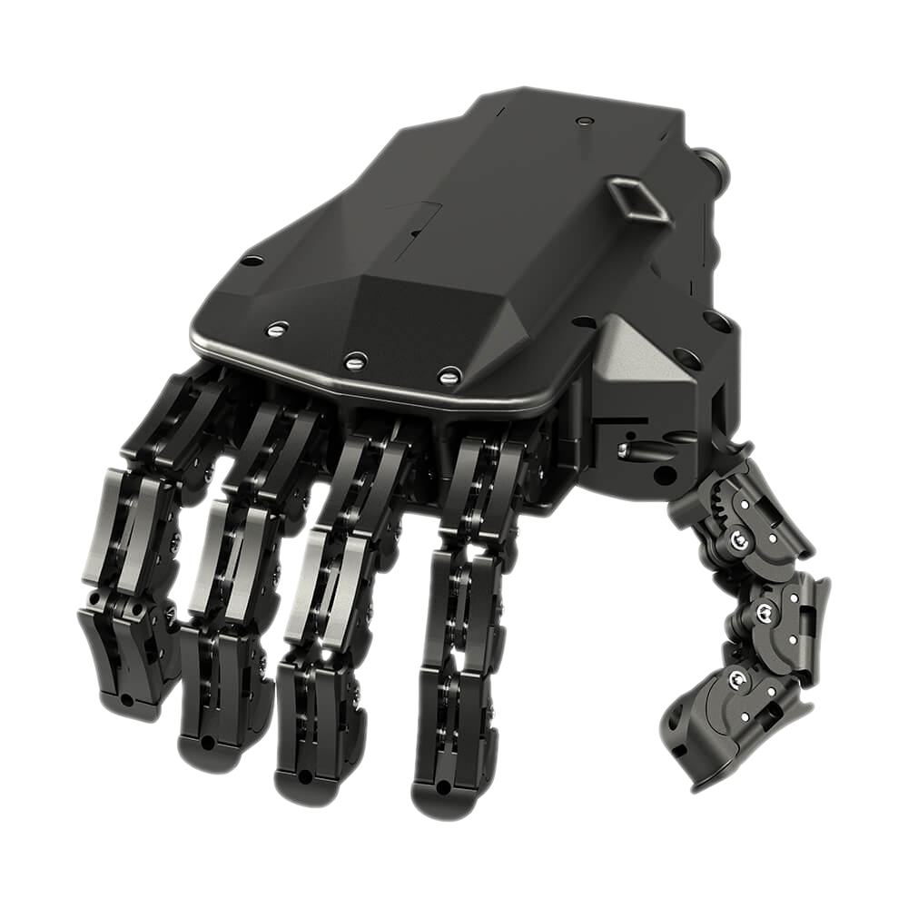
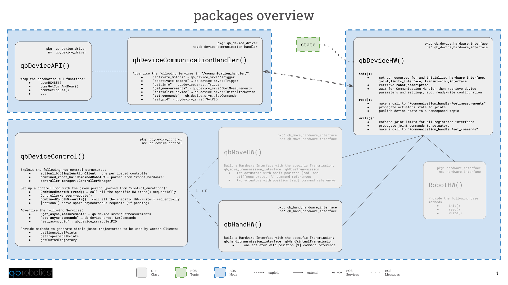
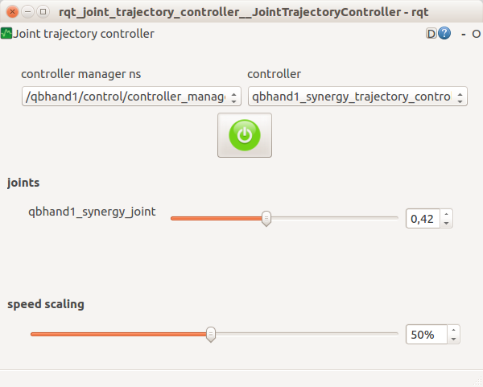
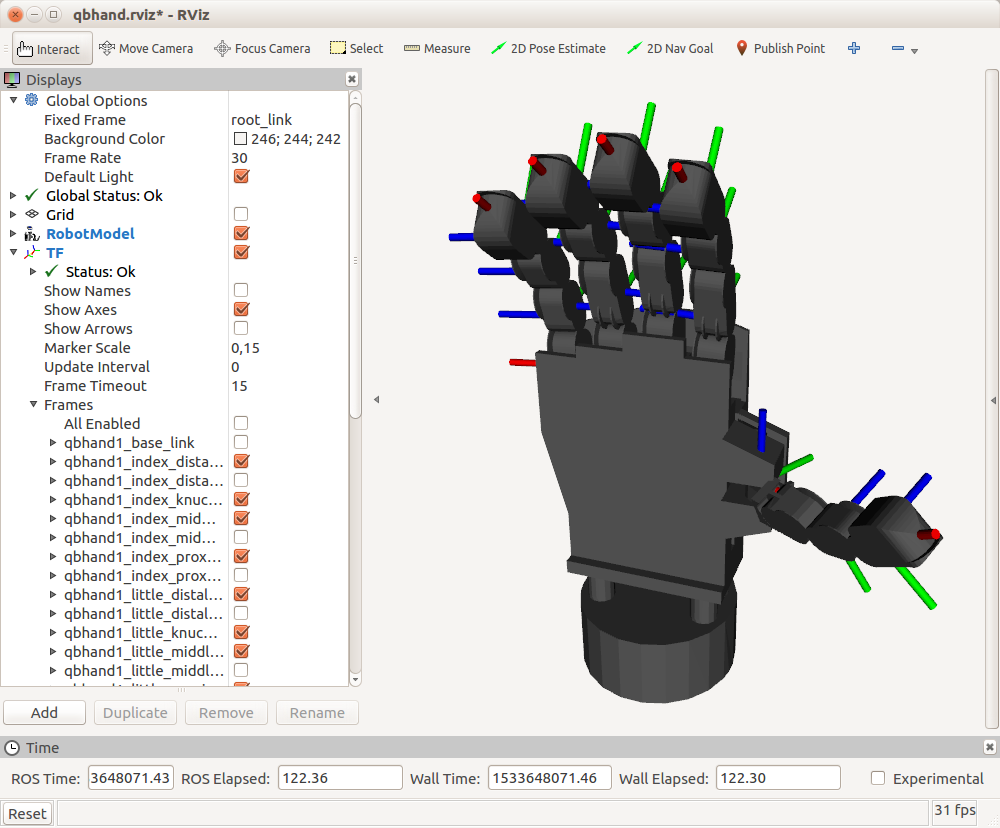

[_qb SoftHand_](https://www.qbrobotics.com/products/qb-softhand/) is an **adaptable yet robust robotic hand** gripper for collaborative robotic arms and for humanoid robots. It is in scale 1:1 with the average human hand and it is similarily composed by 19 completely desensorized phalanges and a flat palm.

The specific system of tendons connected to just a single motor provides the mechanical adaptability of the grasp to the shape and softness of any object without damaging it, i.e. exploiting the intrinsic capability of soft robots to continuously deform in a huge variety of possible configurations through interaction with external items.

In addition, the single actuator fixed directly on the back of the hand barely affects the total encumbrance and weight (only 480 grams) of the device.



## Table of Contents
1. [Installation](#markdown-header-installation)
   1. [Requirements](#markdown-header-requirements)
   1. [Ubuntu Packages](#markdown-header-ubuntu-packages)
   1. [Sources](#markdown-header-sources)
   1. [Device Setup](#markdown-header-device-setup)
1. [Usage](#markdown-header-usage)
   1. [Details](#markdown-header-details)
   1. [Communication Handler](#markdown-header-communication-handler)
   1. [Control](#markdown-header-control)
   1. [Control Modes](#markdown-header-control-modes)
         1. [GUI Control](#markdown-header-1.-gui-control)
         1. [Waypoint Control](#markdown-header-2.-waypoint-control)
         1. [API Control](#markdown-header-3.-api-control)
1. [Demo Applications](#markdown-header-demo-applications)
1. [ROS Packages Overview](#markdown-header-ros-packages-overview)
1. [Support, Bugs and Contribution](#markdown-header-support)
1. [Purchase](#markdown-header-purchase)
1. [Roadmap](#markdown-header-roadmap)

>This `README` is basically a mirror of the [_qb SoftHand_ ROS wiki](http://wiki.ros.org/Robots/qbhand) and it is supplied only for offline documentation. Please, refer to the online wiki whenever you can; it is our main and most updated reference for _qb SoftHand_ ROS related application.

## Installation
### Requirements
If you have never set it up, you probably need to add your linux user to the `dialout` group to grant right access to the serial port resources. To do so, just open a terminal and execute the following command:
```
sudo gpasswd -a <user_name> dialout
```
where you need to replace the `<user_name>` with your current linux username.

_Note: don't forget to logout or reboot._

### Ubuntu Packages
If you prefer to leave your catkin workspace as it is, you can simply install all the ROS packages from the Ubuntu official repositories:
```
sudo apt update
sudo apt install ros-kinetic-qb-hand
```

### Sources
>Since you are interested in the ROS interfaces for our devices, it is assumed that you are familiar at least with the very basics of the ROS environment. If not, it might be useful to spend some of your time with [ROS](http://wiki.ros.org/ROS/Tutorials) and [catkin](http://wiki.ros.org/catkin/Tutorials) tutorials. After that, don't forget to come back here and start having fun with our Nodes.

Install the _qb SoftHand_ packages for a ROS user is straightforward. Nonetheless the following are the detailed steps which should be easy to understand even for ROS beginners:

1. Clone both the `qb_device` and `qb_hand` packages to your Catkin Workspace, e.g. `~/catkin_ws`:
   ```
   cd `~/catkin_ws/src`
   git clone https://bitbucket.org/qbrobotics/qbdevice-ros.git
   git clone https://bitbucket.org/qbrobotics/qbhand-ros.git
   ```

1. Compile the packages using `catkin`:
   ```
   cd `~/catkin_ws`
   catkin_make
   ```
   **Note:** depending on your ROS installation, you may need some extra packages to properly compile the code. Please, be sure that you have already installed at least `ros-kinetic-ros-controllers`, `ros-kinetic-transmission-interface`, `ros-kinetic-joint-limits-interface`, `ros-kinetic-combined-robot-hw`, and their dependencies (_e.g. use `sudo apt install <ros-pkg>`_).

1. If you were not familiar with ROS you should be happy now: everything is done! Nonetheless, if you encounter some troubles during the compilation, feel free to ask for support on [our Bitbucket](https://bitbucket.org/account/user/qbrobotics/projects/ROS).

### Device Setup
Connect a _qb SoftHand_ to your system is basically a matter of plugging in a USB cable. Nonetheless, **read carefully** the [manual](https://www.qbrobotics.com/products/qb-softhand-research/) to understand all the requirements and advices about either single-device or chained configurations.

## Usage
As shown in the following picture there are two distinct configurations to control several _qb SoftHand_ devices connected to the system:
- The first (and recommended) groups all the Hardware Interfaces together (thanks to the [combined_robot_hw](http://wiki.ros.org/combined_robot_hw)) and exploits them as a unique robot system. We have called it _"synchronous"_ just to point out that every sequence of reads and writes is always done in the same predefined order.
- The second mode threats every device as an independent Hardware Interface with its dedicated ROS Node which executes the control loop independently w.r.t. the rest of the system, i.e. _"asynchronously"_.

Mixed configurations can be also achieved through a proper setup. In such a case we can think of synchronous sub-systems which execute asynchronously w.r.t. each other.

>Note that in a single-device system the synchronous mode is a nonsense. 


In both cases there is always one central Node which manages the shared resources for the serial communication (e.g. one or many USB ports) and which provides several ROS services to whom wants to interact with the connected devices. This Node is called _Communication Handler_ and it is usually started in a separate terminal.

>Please remember that in a multi-device configuration, each _qbrobotics®_ device connected to your system **must have a unique ID**.

### Details
To understand what is hiding under the hood, have a look at the C++ classes overview which sums up all the main concepts of our ROS packages:



### Communication Handler
The Communication Handler Node has no parameters to be set, therefore it is always launched like this:
```
roslaunch qb_device_driver communication_handler.launch
```

On start, it scans the serial communication resources connected to your system and shows a list of the devices it has found. By default, it never scans again for new devices, apart from asking it explicitly during the initialization of a control Node.

This is a simple example when starting the Communication Handler with two _qbrobotics®_ devices connected on two distinct USB ports:
```
[ INFO] [1524044523.511369300]: [CommunicationHandler] handles [/dev/ttyUSB1].
[ INFO] [1524044524.426984697]: [CommunicationHandler] handles [/dev/ttyUSB0].
[ INFO] [1524044525.218613760]: [CommunicationHandler] has found [2] devices connected:
[ INFO] [1524044525.218696997]:                        - device [1] connected through [/dev/ttyUSB0]
[ INFO] [1524044525.218736612]:                        - device [2] connected through [/dev/ttyUSB1]
```

When the Communication Handler is on, it provides all the Services required to interact with the connected devices: e.g. _get info or measurements, activate or deactivate motors, set commands_, and even more... A detailed description of the services can be found in the [qb_device_driver](http://wiki.ros.org/qb_device_driver) package wiki.

### Control
As shown in [Details](#markdown-header-details) the control Node exploits the [ros_control](http://wiki.ros.org/ros_control) Controller Manager which loads and runs the device controllers. Each controller provides an Action Server that, together with the Hardware Interface structure, allows the user to send commands to the relative device and get its measurements.

From an API point of view, it is implemented an Action Client which matches the relative trajectory controller and provides a method to send Goals, i.e. command references, directly to the given device. Additionally the Action Client is subscribed to a Topic (`*_controller/command`) that can be used to send reference commands from outside the code, e.g. asynchronously from the command line, or from a higher level control Node, e.g. as a result of a planning algorithm.

>It is recommended not to mix these two control modes: choose either to control the device directly from the code by extending our API or through this command Topic.

Regardless the control mode chosen for the given application, and apart form a customization of the API, the following launch file templates can be used respectively to control several devices or a single one: 


### Control Modes
For the sake of simplicity, we are going to cover all the control modes for a single _qb SoftHand_, but it is just a matter of putting things together and set the launch file parameters properly to control several devices together ([qb_chain_control](http://wiki.ros.org/qb_chain_control) is dedicated for such a scope). 

All the control modes are initialized in the same manner but with distinct command line arguments. The default single-device control Node which brings everything up and simply waits for commands on the above-mentioned Action topic is the following:
```
roslaunch qb_hand_control control.launch standalone:=true activate_on_initialization:=true device_id:=<actual_device_id>
```

###### The arguments explained
- `activate_on_initialization [false]`: Activates the motor at startup (the device will not move since the first command reference is received).
- `device_id [1]`: Each device has its own ID, you need to set the one of the actual device connect to your system. 
- `standalone [false]`: Starts the Communication Handler together with the control Node. If you set this to `false` (or remove it since the default value is `false`), you need to launch the Communication Handler in a separate terminal.

It is worth noting that the activation of the motor can be postponed to improved safety if you are not aware of the state of the system at startup. To do so just set `activate_on_initialization:=false` (or remove it since the default value is `false`) and make a call to the Communication Handler `activate_motors` Service, when your system is ready, e.g. as follows:
```
rosservice call /communication_handler/activate_motors {"id: <actual_device_id>, max_repeats: 0"}
```

###### Additional arguments
- `control_duration [0.01]`: The duration of the control loop expressed in seconds.
- `get_currents [true]`: Choose whether or not to retrieve current measurements from the device.
- `get_positions [true]`: Choose whether or not to retrieve position measurements from the device.
- `get_distinct_packages [true]`: Choose whether or not to retrieve current and position measurements from the device in two distinct packages.
- `max_repeats [3]`: The maximum number of consecutive repetitions to mark retrieved data as corrupted.
- `set_commands [true]`: Choose whether or not to send command positions to the device.
- `set_commands_async [true]`: Choose whether or not to send commands without waiting for ack.
- `use_rviz [false]`: Choose whether or not to use rviz. If enabled you should see a virtual hand on screen performing a similar behavior.

   >Be aware that the _qb SoftHand_ is desensorized and therefore it is not possible to know exactly the position of each finger: the screen visualization is just the result of an estimation of the closure value and may differ from the real configuration of your _qb SoftHand_ (e.g. when grasping an object).

The followings are particular control modes which are enabled with few parameters, but the concepts of this paragraph hold for all of them.

#### 1. GUI Control
This control mode is the one suggested to test that everything is working as expected. You are able to open and close the _qb SoftHand_ interactively, but nothing more than this.

>You will probably need this only the very first times and for debugging.

To start this mode just add `use_controller_gui:=true` to the general `roslaunch` command (be sure that the opposite `use_waypoints` is not used).

After a while a GUI should appear to screen with two empty dropdown menus, a red enable button below them, and a _speed scaling_ slider at the bottom.
1. Select the _Controller Manager_ namespace from the left menu, e.g. `/<robot_namespace>/control/controller_manager` (where `<robot_namespace>` is an additional argument of the launch file needed with several devices). This enables the right menu which provides all the controllers available for the connected device.
1. Select the _qb SoftHand_ controller from the second dropdown menu and enable it through the circular button.
1. A single slider will appear in the GUI to control the closure of the hand, which ranges from `0` (hand completely open) to `1` (hand completely closed). Move the slider to perform a complete grasp or to partially open/close the _qb SoftHand_. You can also vary the speed through the bottom _speed scaling_ slider if you like a faster/slower motion. No other timing constraints can be set in this mode.



#### 2. Waypoint Control
This control mode is a bit more structured and useful than the previous: it allows to set a fixed trajectory of any number of position waypoints (with timing constraints) and set the robot to cycle infinitely on it (because of the loop it is recommended to set the first and last waypoint in a similar configuration to avoid unwanted sudden changes).

To start this mode just add `use_waypoints:=true` to the general `roslaunch` command (be sure that the opposite `use_controller_gui` is not used). You won't see any control interface in this case but the _qb SoftHand_ should start moving according to the given trajectory, parsed from a yaml file located at
```
<robot_package>_control/config/<robot_name>_waypoints.yaml
```
where `robot_name` and `robot_package` are two additional launch file arguments.

##### Customization
You can modify the waypoint trajectory to replicate the behavior you want: either change the `<robot_package>_control/config/<robot_name>_waypoints.yaml` or add another custom application-specific file in the `config` directory. In the second case you need to set the argument `robot_name` properly when launching the command from the terminal.

The waypoint configuration is as follows:
```
# Waypoints describe the desired motion trajectory:
#  - time [s]: can be either a single value or an interval for which joint_positions hold
#  - joint_positions:
#     - hand closure [0,1];
#  - joint_velocities: optional, use it only if you want a nonzero value
#     - hand closure [0,1]/s;
#  - joint_accelerations: optional, use it only if you want a nonzero value
#     - hand closure [0,1]/s^2;
#
# It is worth noting that, if specified, joint_positions, joint_velocities and joint_accelerations must be of size one.

waypoints:
 -
   time: [1.0]
   joint_positions:
     <device_name>: [0.0]
 -
   time: [2.25, 2.75]
   joint_positions:
     <device_name>: [0.8]
  -
    time: [4.0]
    joint_positions:
      <device_name>: [0.5]
    joint_velocities:
      <device_name>: [-0.5]
 -
   ...
```

#### 3. API Control
If you need a complex (i.e. real) control application, e.g. the _qb SoftHand_ is mounted on a robot which uses computer vision aid to grasp objects, the previous two control modes don't really help much. What we provide for real applications is the full ROS libraries to manage and control the _qb SoftHand_.

You have to dig into the [qb_hand](http://wiki.ros.org/qb_hand) package documentation and find what better suits for your needs, e.g. extend the `qbDeviceControl` class provided, or even redesign some of its parts by following an approach similar to ours.

>Our recommendation is to use as much as possible our resources, classes and macros to help you while developing your application. Don't reinvent the wheel!

At last, if you come up with a something useful for the whole community, it will be amazing if you propose your improvement with a Pull Request in the package of interest on [our Bitbucket](https://bitbucket.org/account/user/qbrobotics/projects/ROS).

## Demo Applications


## ROS Packages Overview
| |Packages|
|---:|---|
|[qb_device](http://wiki.ros.org/qb_device): |[qb_device_bringup](http://wiki.ros.org/qb_device_bringup), [qb_device_control](http://wiki.ros.org/qb_device_control), [qb_device_description](http://wiki.ros.org/qb_device_description), [qb_device_driver](http://wiki.ros.org/qb_device_driver), [qb_device_hardware_interface](http://wiki.ros.org/qb_device_hardware_interface), [qb_device_msgs](http://wiki.ros.org/qb_device_msgs), [qb_device_srvs](http://wiki.ros.org/qb_device_srvs), [qb_device_utils](http://wiki.ros.org/qb_device_utils)|
|[qb_hand](http://wiki.ros.org/qb_hand): |[qb_hand_control](http://wiki.ros.org/qb_hand_control), [qb_hand_description](http://wiki.ros.org/qb_hand_description), [qb_hand_hardware_interface](http://wiki.ros.org/qb_hand_hardware_interface)|

## Support, Bugs and Contribution
Since we are not only focused on this project it might happen that you encounter some trouble once in a while. Maybe we have just forget to think about your specific use case or we have not seen a terrible bug inside our code. In such a case, we are really sorry for the inconvenience and we will provide any support you need.

To help you in the best way we can, we are asking you to do the most suitable of the following steps:

1. It is the first time you are holding a _qb SoftHand_, or the first time you are using ROS, or even both: it is always a pleasure for us to solve your problems, but please consider first to read again the instructions above and the ROS tutorials. If you have ROS related questions the right place to ask is [ROS Answers](http://answers.ros.org/questions/).
1. You are a beginner user stuck on something you completely don't know how to solve or you are experiencing unexpected behaviour: feel free to contact us at [support+ros at qbrobotics.com](support+ros@qbrobotics.com), you will receive the specific support you need as fast as we can handle it.
1. You are quite an expert user, everything has always worked fine, but now you have founded something strange and you don't know how to fix it: we will be glad if you open an Issue in the package of interest on [our Bitbucket](https://bitbucket.org/account/user/qbrobotics/projects/ROS).
1. You are definitely an expert user, you have found a bug in our code and you have also correct it: it will be amazing if you open a Pull Request in the package of interest on [our Bitbucket](https://bitbucket.org/account/user/qbrobotics/projects/ROS); we will merge it as soon as possible.
1. You are comfortable with _qbrobotics®_ products but you are wondering whether is possible to add some additional software features: feel free to open respectively an Issue or a Pull Request in the package of interest on [our Bitbucket](https://bitbucket.org/account/user/qbrobotics/projects/ROS), according to whether it is just an idea or you have already provided your solution.

In any case, thank you for using [_qbrobotics®_](https://www.qbrobotics.com) solutions.

## Purchase
If you have just found out our company and you are interested in our products, come to [visit us](https://www.qbrobotics.com) and feel free to ask for a quote.

## Roadmap
Features to be implemented in the future:

- Improve stability
- CI an tests
- Gazebo simulation
- Improved controller to better replicate the real grasp